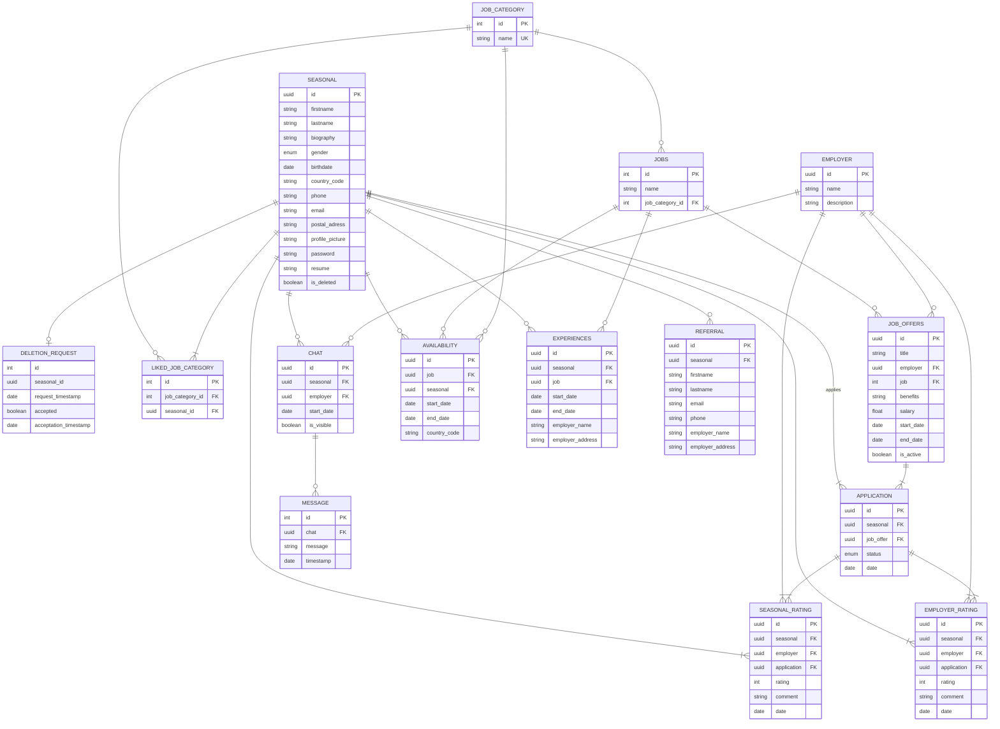

# Database logic schema

```mermaid
erDiagram
    SEASONAL {
        uuid id PK
        string firstname
        string lastname
        string biography
        enum gender
        date birthdate
        string country_code
        string phone
        string email
        string postal_adress
        string profile_picture
        string password
        string resume
        boolean is_deleted
    }
    
    DELETION_REQUEST {
        int id
        uuid seasonal_id
        date request_timestamp
        boolean accepted
        date acceptation_timestamp
    }
    
    SEASONAL ||--o| DELETION_REQUEST: ""
    
    JOB_CATEGORY {
        int id PK
        string name UK
    }
    
    JOBS {
        int id PK
        string name
        int job_category_id FK
    }
    
    LIKED_JOB_CATEGORY {
        int id PK
        int job_category_id FK
        uuid seasonal_id FK
    }
    
    JOB_CATEGORY ||--o{ LIKED_JOB_CATEGORY: ""
    
    SEASONAL ||--|{ LIKED_JOB_CATEGORY: ""
    
    EMPLOYER {
        uuid id PK
        string name
        string description
    }
    
    JOB_OFFERS {
        uuid id PK
        string title
        uuid employer FK
        int job FK
        string benefits
        float salary
        date start_date
        date end_date
        boolean is_active
    }
    
    JOB_CATEGORY ||--o{ JOBS: ""
    JOBS ||--o{ JOB_OFFERS: ""
    EMPLOYER ||--o{ JOB_OFFERS: ""
    
    APPLICATION {
        uuid id PK
        uuid seasonal FK
        uuid job_offer FK
        enum status
        date date
    }
    
    SEASONAL ||--|{ APPLICATION: "applies"
    JOB_OFFERS ||--|{ APPLICATION: ""
    
    CHAT {
        uuid id PK
        uuid seasonal FK
        uuid employer FK
        date start_date
        boolean is_visible
    }
    
    SEASONAL ||--o{ CHAT: ""
    EMPLOYER ||--o{ CHAT: ""
    
    MESSAGE {
        int id PK
        uuid chat FK
        string message
        date timestamp
    }
    
    CHAT ||--o{ MESSAGE: ""
    
    AVAILABILITY {
        uuid id PK
        uuid job FK
        uuid seasonal FK
        date start_date
        date end_date
        string country_code
    }
    
    SEASONAL ||--o{ AVAILABILITY: ""
    JOBS ||--o{ AVAILABILITY: ""
    JOB_CATEGORY ||--o{ AVAILABILITY: ""
    
    EXPERIENCES {
        uuid id PK
        uuid seasonal FK
        uuid job FK
        date start_date
        date end_date
        string employer_name
        string employer_address
    }
    
    SEASONAL ||--o{ EXPERIENCES: ""
    JOBS ||--o{ EXPERIENCES: ""
    
    REFERRAL {
        uuid id PK
        uuid seasonal FK
        string firstname
        string lastname
        string email
        string phone
        string employer_name
        string employer_address
    }
    
    SEASONAL ||--o{ REFERRAL: ""
    
    SEASONAL_RATING {
        uuid id PK
        uuid seasonal FK
        uuid employer FK
        uuid application FK
        int rating
        string comment
        date date
    }
    
    EMPLOYER_RATING {
        uuid id PK
        uuid seasonal FK
        uuid employer FK
        uuid application FK
        int rating
        string comment
        date date
    }
    
    SEASONAL ||--|{ SEASONAL_RATING: ""
    EMPLOYER ||--|{ SEASONAL_RATING: ""
    APPLICATION ||--|{ SEASONAL_RATING: ""
    
    SEASONAL ||--|{ EMPLOYER_RATING: ""
    EMPLOYER ||--|{ EMPLOYER_RATING: ""
    APPLICATION ||--|{ EMPLOYER_RATING: ""
```